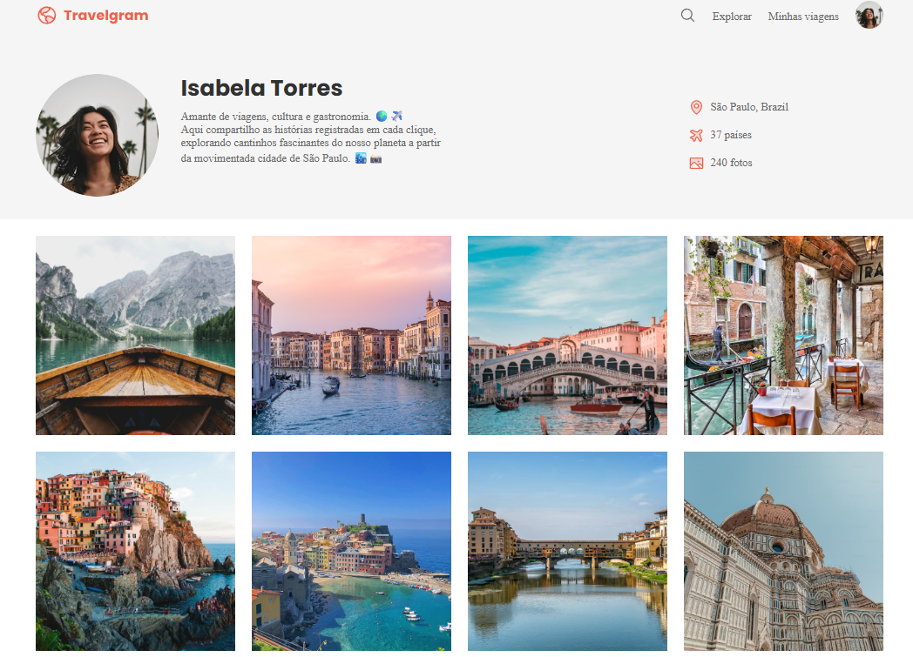

# ✈️ Travelgram

Projeto desenvolvido como parte dos estudos da Rocketseat, simulando o perfil de uma rede social focada em viagens. O foco deste projeto é a organização de elementos e galerias utilizando **Flexbox**.

---

## 📸 Demonstração



---

## 🚀 Tecnologias Utilizadas

* **HTML5**
* **CSS3** (Foco em Flexbox)
* **Google Fonts**

---

## 📚 Sobre o Projeto

O **Travelgram** é uma página de perfil que apresenta informações do usuário e uma galeria de fotos. O grande diferencial deste desafio foi estruturar todo o layout — desde o cabeçalho até a grade de fotos — sem o uso de CSS Grid, dependendo exclusivamente do modelo flexível.

**O que foi praticado:**
* **Alinhamento com Flexbox**: Uso de `flex-wrap`, `justify-content` e `align-items` para criar a galeria.
* **Proporções dinâmicas**: Controle de largura dos itens da galeria com a propriedade `flex`.
* **Estilização de Componentes**: Criação de avatares circulares, botões e contadores de métricas.
* **Organização de Assets**: Gerenciamento de múltiplas imagens de alta qualidade.

---

## 📂 Estrutura de Pastas

```bash
/
├── index.html
├── style.css
└── assets/
    └── (fotos de viagens, avatar e ícones)
```

---

## 💻 Como Executar
1. Clone este repositório:
```bash
git clone https://github.com/DlrRogerio/projeto-travelgram.git
```
2. Entre na pasta do projeto:
```bash
cd projeto-travelgram
```
3. Abra o arquivo ```index.html``` no seu navegador preferido.

---

## 🔧 Melhorias Futuras

- Implementar CSS Grid para comparar as duas formas de construção de layout.
- Adicionar Media Queries para tornar a galeria responsiva em dispositivos móveis.
- Criar um efeito de Modal (Lightbox) para abrir as fotos ao clicar.
- Aplicar uma transição suave (hover) para escurecer a foto e mostrar ícones de curtidas/comentários.

---

## 📄 Licença

Este projeto foi desenvolvido para fins educacionais seguindo o guia da Rocketseat.
